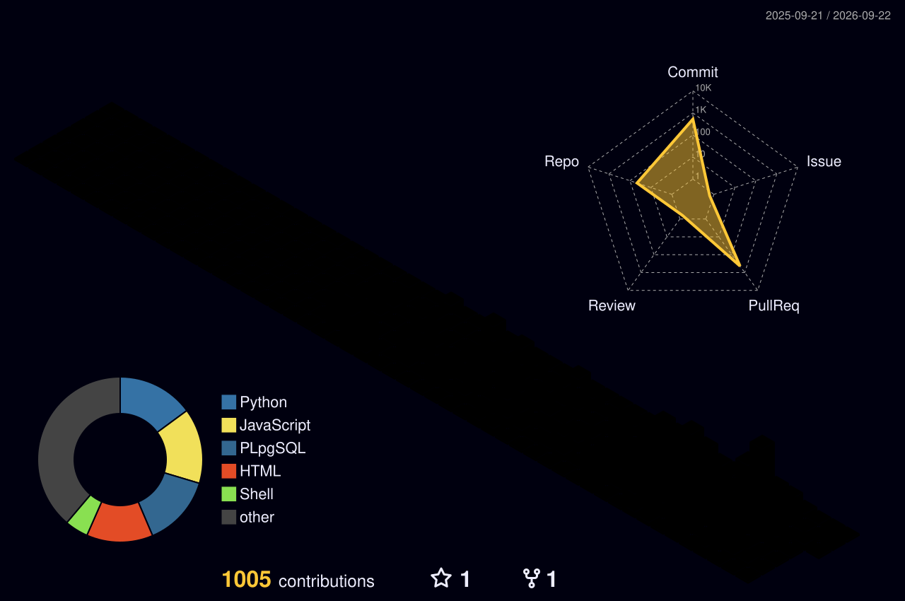

  <!-- Saludo animado e imagen de perfil -->
  
  
    

  

  # Henrik Anderson Oloroso García 

  ### 🚀 Desarrollador Full Stack Junior
  📍 **Ciudad de Guatemala, Guatemala 🇬🇹**

  <!-- Badges de Contacto -->
  
  

    

  > *Desarrollador enfocado en la resolución eficiente de problemas, pensamiento crítico y aprendizaje continuo. Apasionado por la creación de soluciones funcionales mediante código limpio, arquitectura de datos e innovación tecnológica.*

---

## 🎯 Sobre Mí

* 🔭 Actualmente perfeccionando mis habilidades en la construcción de aplicaciones Full Stack.
* ⚡ Especializándome en **automatización de procesos y flujos de trabajo con n8n**, integrando bots de Telegram, Google Sheets y webhooks.
* 💡 Interesado en la optimización de flujos con **Prompt Engineering** y el desarrollo backend/frontend integrado.
* 🤝 Abierto a participar en proyectos colaborativos y oportunidades laborales donde pueda aportar valor y continuar mi crecimiento profesional.

---

## 🛠️ Habilidades & Tecnologías

### **Frontend**

### **Backend & Lenguajes**

### **Bases de Datos & Administración**

### **Automatización & Workflows**

### **Herramientas & Especialidades**

---

## 🚀 Proyectos & Flujos Destacados

| Proyecto | Descripción | Enlace |
| :--- | :--- | :---: |
| **🤖 TutorBot & Automations (n8n)** | Bot educativo automatizado con n8n, manejo de subflujos personalizados, procesamiento con nodos JS e integración con Telegram y Google Sheets. | [💻 Ver Repositorio](https://github.com/Anderson-Oloroso/Proyecto_TutorBot_AguilarDaniel_OlorosoHenrik.git) |
| **📚 Administrador de Libros, Películas y Música** | Sistema de control y gestión de bases de datos para administrar catálogos multimedia. | [💻 Ver Repositorio](https://github.com/Anderson-Oloroso/AdminLibros.git) |
| **🏪 Administrador de Inventarios** | Aplicación orientada a la gestión y control de inventarios para pequeñas tiendas y negocios. | [💻 Ver Repositorio](https://github.com/Anderson-Oloroso/TallerInventarioTienda.git) |
| **🎮 Ranking de Videojuegos** | Algoritmo y sistema de filtrado que procesa listas de videojuegos para mostrar el TOP 3 con mejores valoraciones. | [💻 Ver Repositorio](https://github.com/Anderson-Oloroso/RankingVideojuegos.git) |

---

## 📊 Estadísticas de GitHub

  ### ⚡ Historial y Frecuencia de Código

  

    

  ### 🧊 Métricas de Contribución & Actividad 3D

  

---

<!-- Footer Terminal Interactivo Neón (Español) -->

  

    

  

    

  <b>Henrik Anderson Oloroso García</b> • Desarrollador Full Stack & Automatización

